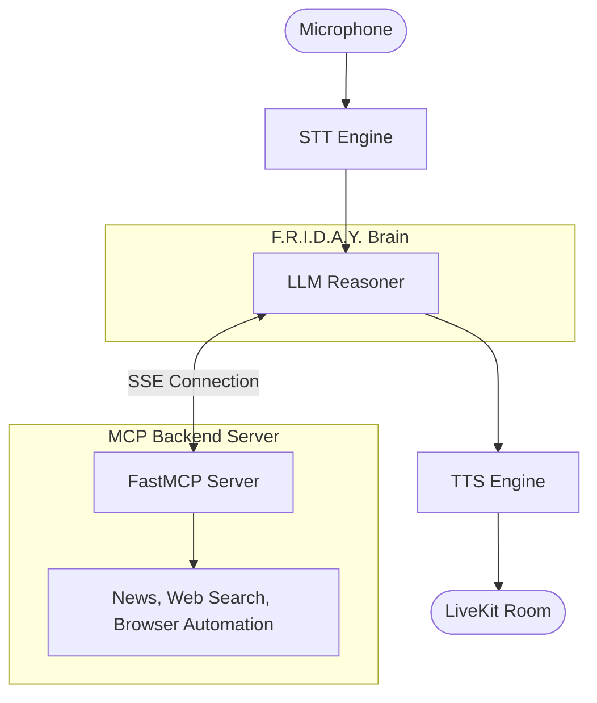

# 🚀 F.R.I.D.A.Y. — Tony Stark Demo

> *"Fully Responsive Intelligent Digital Assistant for You"*

A Tony Stark-inspired AI assistant split into two cooperating pieces:

| Component | What it is |
|-----------|-----------|
| **MCP Server** (`uv run friday`) | A [FastMCP](https://github.com/jlowin/fastmcp) server that exposes tools (news, web search, system info, browser automation...) over SSE. Think of it as the Stark Industries backend — it does the actual work. |
| **Voice Agent** (`uv run friday_voice`) | A [LiveKit Agents](https://github.com/livekit/agents) voice pipeline that listens to your microphone, reasons with an LLM (`gpt-4o` or Gemini), and speaks back with OpenAI TTS — all while pulling tools from the MCP server in real time. |

---

## ✨ Features
- **🎙️ Real-time Voice Interaction:** Low-latency speech-to-speech using LiveKit.
- **🌐 Universal Browser Automation:** Powered by `browser-use` and Playwright, F.R.I.D.A.Y. can literally open a Chrome window, click, scroll, and operate websites on your behalf!
- **🛠️ MCP Tools Backend:** Scalable and extensible FastMCP architecture for dynamic tool access.
- **☁️ Multi-LLM Support:** Seamlessly swap between OpenAI GPT-4o, Google Gemini, Groq, etc.

---

## ⚙️ How it works



The voice agent connects to the MCP server via SSE at `http://127.0.0.1:8000/sse` (auto-resolved to the Windows host IP when running inside WSL).

---

## 🚀 Quick start

### 1. Prerequisites
- Python ≥ 3.11
- [`uv`](https://github.com/astral-sh/uv) — `pip install uv` or `curl -Lsf https://astral.sh/uv/install.sh | sh`
- A [LiveKit Cloud](https://cloud.livekit.io) project (free tier works)

### 2. Clone & install
```bash
git clone https://github.com/anandmahadevv/FRIDAY.git
cd FRIDAY
uv sync          # creates .venv and installs all dependencies
uv run playwright install # installs browsers for automation
```

### 3. Set up environment
```bash
cp .env.example .env
# Open .env and fill in your API keys safely (this file is ignored by git!)
```

### 4. Run — two terminals

**Terminal 1 — MCP server** (must start first)
```bash
uv run friday
```
Starts the FastMCP server on `http://127.0.0.1:8000/sse`. The voice agent connects here to fetch its tools.

**Terminal 2 — Voice agent**
```bash
uv run friday_voice
```
Starts the LiveKit voice agent in **dev mode**. Open the [LiveKit Agents Playground](https://agents-playground.livekit.io) and connect to your room to talk to FRIDAY.

---

## 🔒 Security & Environment Variables
Copy `.env.example` → `.env` and fill in the values. **Do NOT commit `.env` to version control.** It is safely ignored in `.gitignore`.

| Variable | Required | Where to get it |
|----------|----------|----------------|
| `LIVEKIT_URL` | ✅ | [LiveKit Cloud dashboard](https://cloud.livekit.io) → your project URL |
| `LIVEKIT_API_KEY` | ✅ | LiveKit Cloud → API Keys |
| `LIVEKIT_API_SECRET` | ✅ | LiveKit Cloud → API Keys |
| `GROQ_API_KEY` | optional | [console.groq.com](https://console.groq.com) |
| `SARVAM_API_KEY` | ✅ (default STT) | [dashboard.sarvam.ai](https://dashboard.sarvam.ai) |
| `OPENAI_API_KEY` | ✅ (default TTS) | [platform.openai.com/api-keys](https://platform.openai.com/api-keys) |
| `DEEPGRAM_API_KEY` | optional | [console.deepgram.com](https://console.deepgram.com) |
| `GOOGLE_API_KEY` | ✅ (default LLM) | [aistudio.google.com](https://aistudio.google.com/projects) |

---

## 🛠 Tech stack
- **[FastMCP](https://github.com/jlowin/fastmcp)** — MCP server framework
- **[LiveKit Agents](https://github.com/livekit/agents)** — real-time voice pipeline
- **[browser-use](https://github.com/browser-use/browser-use)** — Universal browser automation via Playwright
- **Sarvam Saaras v3** — STT (Indian-English optimised)
- **OpenAI / Gemini** — LLMs and TTS (`nova` voice)
- **[uv](https://github.com/astral-sh/uv)** — fast Python package manager

---

## 📝 License
MIT
